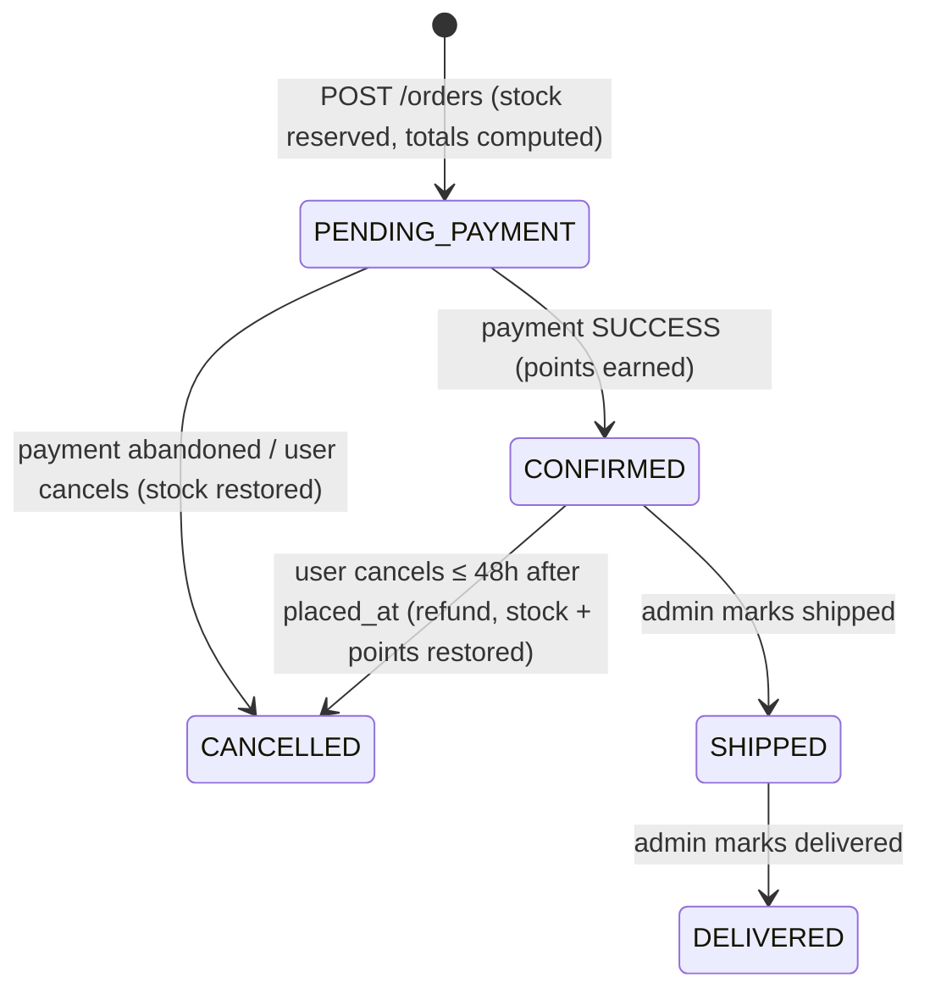

# Book Worm — data model (DRAFT for review)

Status: **proposal, not approved.** Step 2 of the capstone workflow ("Data model design — reviewed
manually"). Items marked **OPEN** are not covered by the brief and need a decision before the
OpenAPI spec is written. The proposed default for each is shown so the draft is complete, but none
of them are final.

Conventions used throughout:

- PostgreSQL. Primary keys are `bigint GENERATED ALWAYS AS IDENTITY` (maps to `Long` in JPA).
- Money is `numeric(10,2)` in INR (₹). No floats anywhere for money.
- Timestamps are `timestamptz`, stored in UTC; `created_at` / `updated_at` on mutable tables.
- Enums are stored as `varchar` with a `CHECK` constraint (JPA `@Enumerated(EnumType.STRING)`).
- Values copied onto an order (prices, titles, address) are **snapshots**, so later edits to a
  book or address never change a past order.

## ERD

```mermaid
erDiagram
    USERS ||--o{ ADDRESSES : "saves"
    USERS ||--o| CARTS : "owns"
    USERS ||--o{ WISHLIST_ITEMS : "wishes"
    USERS ||--o{ REVIEWS : "writes"
    USERS ||--o{ ORDERS : "places"
    USERS ||--o{ GIFT_POINT_TRANSACTIONS : "earns/spends"

    CATEGORIES ||--o{ BOOKS : "classifies"
    AUTHORS ||--o{ BOOKS : "writes"
    PUBLISHERS ||--o{ BOOKS : "publishes"
    BOOKS ||--o{ BOOK_GENRES : "tagged"
    GENRES ||--o{ BOOK_GENRES : "tags"

    BOOKS ||--o{ REVIEWS : "receives"
    BOOKS ||--o{ WISHLIST_ITEMS : "in"
    CARTS ||--o{ CART_ITEMS : "contains"
    BOOKS ||--o{ CART_ITEMS : "in"

    ORDERS ||--|{ ORDER_ITEMS : "contains"
    BOOKS ||--o{ ORDER_ITEMS : "sold as"
    ORDERS ||--o{ PAYMENTS : "paid by"
    COUPONS |o--o{ ORDERS : "applied to"
    ORDERS |o--o{ GIFT_POINT_TRANSACTIONS : "causes"

    USERS {
        bigint id PK
        varchar email UK
        varchar password_hash "BCrypt"
        varchar first_name
        varchar last_name
        varchar phone
        varchar role "CUSTOMER | ADMIN"
        int gift_points_balance "CHECK >= 0"
        timestamptz created_at
        timestamptz updated_at
    }
    ADDRESSES {
        bigint id PK
        bigint user_id FK
        varchar first_name
        varchar last_name
        varchar email
        varchar address_line
        varchar city
        varchar state
        char pin_code "6 digits"
        varchar phone_country_code "default +91"
        varchar phone_number
        varchar country "default India"
        boolean is_default
        timestamptz created_at
    }
    CATEGORIES {
        bigint id PK
        varchar name UK
        varchar slug UK
    }
    GENRES {
        bigint id PK
        varchar name UK
    }
    AUTHORS {
        bigint id PK
        varchar name
        varchar photo_url
        text bio
    }
    PUBLISHERS {
        bigint id PK
        varchar name UK
        text description
    }
    BOOKS {
        bigint id PK
        varchar title
        text description
        varchar format "PAPERBACK | HARDCOVER | EBOOK"
        varchar language
        numeric price "CHECK >= 0"
        varchar front_cover_url
        varchar back_cover_url
        int stock_quantity "CHECK >= 0"
        int copies_sold "lifetime, CHECK >= 0"
        date publish_date
        bigint category_id FK
        bigint author_id FK
        bigint publisher_id FK
        bigint version "optimistic lock"
        timestamptz created_at
        timestamptz updated_at
    }
    BOOK_GENRES {
        bigint book_id PK, FK
        bigint genre_id PK, FK
    }
    REVIEWS {
        bigint id PK
        bigint book_id FK
        bigint user_id FK
        smallint rating "CHECK 1-5"
        varchar comment "max 100"
        timestamptz created_at
    }
    WISHLIST_ITEMS {
        bigint id PK
        bigint user_id FK
        bigint book_id FK
        timestamptz created_at
    }
    CARTS {
        bigint id PK
        bigint user_id FK, UK
        timestamptz updated_at
    }
    CART_ITEMS {
        bigint id PK
        bigint cart_id FK
        bigint book_id FK
        int quantity "CHECK > 0"
    }
    COUPONS {
        bigint id PK
        varchar code UK
        varchar discount_type "PERCENT | FLAT"
        numeric discount_value
        numeric min_order_amount
        numeric max_discount_amount "cap for PERCENT"
        timestamptz valid_from
        timestamptz valid_to
        boolean active
    }
    ORDERS {
        bigint id PK
        varchar order_number UK "public id, e.g. BW-20261007-000123"
        bigint user_id FK
        varchar status "see lifecycle"
        varchar ship_first_name "snapshot"
        varchar ship_last_name
        varchar ship_email
        varchar ship_phone
        varchar ship_address_line
        varchar ship_city
        varchar ship_state
        char ship_pin_code
        varchar ship_country
        numeric subtotal
        numeric tax_rate "rate used, e.g. 0.0500"
        numeric tax_amount
        numeric delivery_charge
        bigint coupon_id FK "nullable"
        varchar coupon_code "snapshot"
        numeric discount_amount
        int gift_points_redeemed
        numeric gift_points_amount "₹ value of redeemed points"
        numeric total_amount
        int gift_points_earned
        date estimated_delivery_date
        timestamptz placed_at "starts the 48h window"
        timestamptz shipped_at
        timestamptz cancelled_at
        timestamptz updated_at
    }
    ORDER_ITEMS {
        bigint id PK
        bigint order_id FK
        bigint book_id FK
        varchar title "snapshot"
        varchar format "snapshot"
        numeric unit_price "snapshot"
        int quantity "CHECK > 0"
        numeric line_total
    }
    PAYMENTS {
        bigint id PK
        bigint order_id FK
        varchar method "CREDIT_CARD | DEBIT_CARD | UPI | WALLET"
        numeric amount
        varchar status "SUCCESS | FAILED | REFUNDED"
        varchar card_last4 "nullable, cards only"
        varchar transaction_id UK "generated"
        timestamptz created_at
        timestamptz refunded_at
    }
    GIFT_POINT_TRANSACTIONS {
        bigint id PK
        bigint user_id FK
        bigint order_id FK "nullable"
        varchar type "EARNED | REDEEMED | RESTORED | REVERSED"
        int points "signed: + credit, - debit"
        int balance_after
        timestamptz created_at
    }
```

## Table list

| # | Table | Purpose | Key constraints |
|---|-------|---------|-----------------|
| 1 | `users` | Customer account; JWT subject is `email`. Holds the current gift-points balance. | `email` unique; `gift_points_balance >= 0` |
| 2 | `addresses` | Saved delivery addresses ("Use Saved Address"). | FK `user_id`; `pin_code ~ '^[0-9]{6}$'`; at most one `is_default` per user (partial unique index) |
| 3 | `categories` | Sidebar categories (Romance … Language Learning). "All" is not a row — it means no filter. | `name`, `slug` unique |
| 4 | `genres` | Genre tags shown on cards ("Fiction", "Thriller", "Self Help"). | `name` unique |
| 5 | `authors` | Writers: name, photo, bio ("About the writer"). | — |
| 6 | `publishers` | "Published by: ABC Publishers" link. | `name` unique |
| 7 | `books` | Catalogue item. One row per format. | FKs to category/author/publisher; `price >= 0`; `stock_quantity >= 0`; `version` for concurrent stock updates |
| 8 | `book_genres` | Many-to-many books ↔ genres. | PK (`book_id`, `genre_id`) |
| 9 | `reviews` | 1–5 stars, text ≤ 100 chars. | unique (`book_id`, `user_id`); `rating BETWEEN 1 AND 5`; `char_length(comment) <= 100` |
| 10 | `wishlist_items` | "My Wishlist". No separate wishlist header table — a user has exactly one list. | unique (`user_id`, `book_id`) |
| 11 | `carts` | One persistent server-side cart per user. | `user_id` unique |
| 12 | `cart_items` | Lines in the cart; quantity stepper updates `quantity`. | unique (`cart_id`, `book_id`); `quantity > 0` |
| 13 | `coupons` | "Apply Coupon". | `code` unique (stored upper-case); `discount_value > 0` |
| 14 | `orders` | Placed order with server-computed totals and an address snapshot. | `order_number` unique; all amounts `>= 0` |
| 15 | `order_items` | Lines with price/title snapshots. | `quantity > 0` |
| 16 | `payments` | Simulated payment attempts. Stores **only** method, last 4, amount, status, transaction id. | `transaction_id` unique; `card_last4 ~ '^[0-9]{4}$'` when present; at most one `SUCCESS` per order (partial unique index) |
| 17 | `gift_point_transactions` | Ledger of every points movement; `users.gift_points_balance` is the running total. | `points <> 0` |

### Deliberately **not** stored

- Full card number, CVV, expiry, name on card, UPI ID — validated in the request, then discarded.
- Average rating / review count — computed with an aggregate query (cheap at this scale). Can be
  denormalised onto `books` later if needed.
- Bestsellers this month — computed from `order_items` ⨝ `orders` where `placed_at` is in the
  current month and status ≠ `CANCELLED`. `books.copies_sold` is the lifetime figure shown as
  "Sells: 145 copies sold".
- Tax rate, delivery charge, shipping days, points earn rate — configuration
  (`application.properties`), not tables. The rate actually applied is snapshotted on each order.

## Order lifecycle (proposed)

Cancel is rejected once `SHIPPED`, or when `now() > placed_at + 48h`.

## Indexes beyond PKs / uniques

- `books(category_id)`, `books(author_id)`, `books(publisher_id)`, `books(publish_date DESC)`
  (New Launches), `books(language)`, `books(format)`, `books(price)`.
- `book_genres(genre_id)` for "related books by genre".
- Search on title/author/description: start with `ILIKE`; upgrade to a `pg_trgm` GIN index only if
  needed.
- `orders(user_id, placed_at DESC)` for order history; `orders(status, placed_at)` for bestsellers.
- `reviews(book_id)`, `gift_point_transactions(user_id, created_at DESC)`.

## OPEN questions (need your decision)

1. **Category vs genre tags.** The sidebar has one list of categories, cards show multiple genre
   tags, and the breadcrumb reads "Home / Non-Fiction / Self Help". Proposed: each book has
   **one** category (sidebar filter) plus **many** genre tags; breadcrumb = Home / first tag /
   category. Alternative: a two-level category tree (`categories.parent_id`), e.g. Non-Fiction →
   Self Help.
2. **Formats.** Proposed: each format is its own `books` row (own price and stock; eBook has
   unlimited stock). Alternative: one book with a `book_formats` variants table.
3. **Authors per book.** Wireframe shows one author. Proposed: single `author_id`. Alternative:
   `book_authors` many-to-many.
4. **"My Writers" nav item.** Not described in the brief. Options: (a) authors the user follows
   (new `user_followed_authors` table), (b) authors derived from order history (no table), (c) out
   of scope.
5. **Gift points rates.** Proposed: earn 1 point per ₹100 of `total_amount` (rounded down); 1 point
   = ₹1 on redemption. Earned when the order becomes `CONFIRMED` and reversed if it is cancelled
   — the brief says "earned on completed orders", and with no real shipping there is no natural
   "completed" moment. Alternative: earn only on `DELIVERED`.
6. **Payment flow.** Proposed two steps matching the wireframes: checkout creates the order as
   `PENDING_PAYMENT` and reserves stock; the payment screen then pays it. Alternative: one call
   that places and pays together (simpler; no pending state).
7. **Coupons.** Proposed: PERCENT or FLAT, min order amount, optional cap, validity window,
   unlimited uses. Do you want per-user or total usage limits (adds a `coupon_redemptions`
   table)?
8. **Reviews.** May any logged-in user review, or only users who bought the book?
9. **Admin.** Is a minimal `ADMIN` role in scope (create books/coupons, mark shipped/delivered),
   or is the catalogue seeded via SQL/Flyway and status changes done by hand?
10. **Order of totals.** Proposed: `subtotal → − coupon discount → + tax on the discounted amount
    → + delivery → − gift points = total`. Confirm, or should tax be on the pre-discount
    subtotal?
