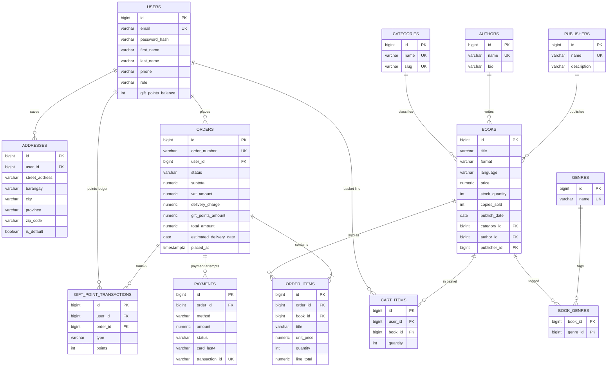

# Book Worm data model

Status: **final for the MVP.** Built from spec [0002](specs/0002-data-model/index.md) and live in
`src/main/resources/db/migration/V1__create_schema.sql` (schema) and `V2__seed_catalogue.sql` (demo catalogue).
Any change from here on is a new `V3+` Flyway migration; applied scripts are never edited.

Conventions:

- PostgreSQL 16 (H2 in PostgreSQL mode for tests). Primary keys are `bigint GENERATED BY DEFAULT AS IDENTITY`.
- Money is `numeric(12,2)` in Philippine pesos (PHP, ₱). Book prices are VAT exclusive; VAT is 12%.
- Timestamps are `timestamp with time zone`, stored in UTC. Text is `varchar` only.
- Enum like columns are `varchar` with a named `CHECK` list, mapped with `@Enumerated(EnumType.STRING)`.
- Every constraint is named (`pk_`, `fk_`, `uq_`, `ck_`), so errors can be mapped by name.
- Orders copy prices, titles and the shipping address at checkout (snapshots), so later edits never change a past order.
- Card data is never stored beyond the last 4 digits. No column holds a card number, CVV, expiry or wallet number.

## ERD



## Tables

Columns are NOT NULL unless marked `null`. Every table also has `id`.

| Table | Columns | Rules (named constraints) |
|---|---|---|
| `users` | `email`, `password_hash` (BCrypt), `first_name`, `last_name`, `phone` null, `role`, `gift_points_balance`, `created_at`, `updated_at` | email unique and lower case; role `CUSTOMER` or `ADMIN`; balance at least 0 |
| `addresses` | `user_id`, `first_name`, `last_name`, `email`, `phone` (`+639XXXXXXXXX`), `street_address`, `barangay` null, `city`, `province`, `zip_code`, `country`, `is_default`, `created_at` | ZIP code is 4 characters |
| `categories` | `name`, `slug` | both unique (19 rows, the wireframe sidebar) |
| `genres` | `name` | unique (10 rows) |
| `authors` | `name`, `photo_url` null, `bio` null | name unique |
| `publishers` | `name`, `description` null | name unique |
| `books` | `title`, `description`, `format`, `language`, `price`, `front_cover_url` null, `back_cover_url` null, `stock_quantity`, `copies_sold`, `publish_date`, `category_id`, `author_id`, `publisher_id`, `created_at`, `updated_at` | one row per title and format; format `PAPERBACK`, `HARDCOVER` or `EBOOK`; price, stock and copies sold at least 0 |
| `book_genres` | `book_id`, `genre_id` | composite key; rows go when the book goes |
| `cart_items` | `user_id`, `book_id`, `quantity`, `created_at`, `updated_at` | one line per user and book; quantity at least 1 |
| `orders` | `order_number`, `user_id`, `status`, shipping snapshot (`ship_first_name` to `ship_country`), `subtotal`, `vat_rate`, `vat_amount`, `delivery_charge`, `gift_points_redeemed`, `gift_points_amount`, `total_amount`, `gift_points_earned`, `estimated_delivery_date`, `placed_at`, `paid_at` null, `shipped_at` null, `delivered_at` null, `cancelled_at` null, `updated_at` | order number unique; status `PENDING_PAYMENT`, `CONFIRMED`, `SHIPPED`, `DELIVERED` or `CANCELLED`; every amount at least 0; `total = subtotal + VAT + delivery - points amount` |
| `order_items` | `order_id`, `book_id`, `title`, `format`, `unit_price`, `quantity`, `line_total` | quantity at least 1; `line_total = unit_price × quantity` |
| `payments` | `order_id`, `method`, `amount`, `status`, `card_last4` null, `transaction_id`, `failure_reason` null, `created_at`, `refunded_at` null | method `CREDIT_CARD`, `DEBIT_CARD` or `E_WALLET`; status `SUCCESS`, `FAILED` or `REFUNDED`; card payments need exactly 4 last digits; transaction id unique |
| `gift_point_transactions` | `user_id`, `order_id`, `type`, `points`, `created_at` | type `EARNED`, `RESTORED` (points above 0) or `REDEEMED`, `REVERSED` (points below 0) |

Also: the sequence `order_number_seq` feeds order numbers like `BW-20261007-000001`, and indexes cover every
foreign key used for browsing and history (`books` by category, author, publisher and publish date; orders by user and date).

## Order status

```
PENDING_PAYMENT ──pay SUCCESS──▶ CONFIRMED ──(tests only)──▶ SHIPPED ──▶ DELIVERED
      │                              │
      └──cancel (any time)──┐        └──cancel (within 48h of placed_at)──┐
                            ▼                                              ▼
                        CANCELLED ◀────────────────────────────────────────┘
```

A failed payment leaves the order `PENDING_PAYMENT` so you can pay again. Every change is one guarded
`UPDATE ... WHERE status IN (...)`, so two requests at once can never both win.

## Not stored on purpose

Reviews and ratings, wishlist and coupons (out of MVP scope); bestsellers, recommendations and related books
(computed by query); the currency (always PHP, from config); any card number, CVV, expiry or wallet number.
