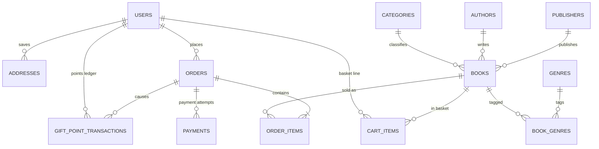

# 0002. Relational data model for the Book Worm store

**Date**: 2026-10-07
**Status**: Proposed

## Summary

This spec fixes the database tables for the whole MVP: users and their saved addresses, the book catalogue (categories, genre tags, authors, publishers, books), the basket, orders with their lines, simulated payments, and a gift points ledger. Everything is priced in Philippine pesos (₱) and addresses use the Philippine format. The schema ships as two Flyway scripts (versioned SQL files that run at startup): one creates the tables, one loads a demo catalogue. Every later feature builds on these tables, so changing them later means a new migration, not an edit.

## Requirements

**User stories**:
- As the developer, I want one agreed schema so that every journey (catalogue, basket, checkout, payment, cancel, history, recommendations) builds on the same tables without a breaking migration.
- As a reviewer, I want a demo catalogue already loaded so that I can browse, buy and cancel straight away in Insomnia.
- As a customer, I want my card details never stored so that a leak of the database cannot expose them.

**Acceptance criteria** (the contract):
- **AC-1**: Starting the app against an empty `bookworm` PostgreSQL database applies `V1__create_schema.sql` and `V2__seed_catalogue.sql` through Flyway with no error, and Hibernate's `validate` check passes for every entity.
- **AC-2**: The same two migrations apply on H2 in PostgreSQL mode (the URL from spec 0001, not a replaced embedded database) during `mvn clean install`, and the build stays green.
- **AC-3**: After migration the database holds exactly the 19 categories listed below, the 10 genres listed below, at least 6 authors, at least 4 publishers and at least 24 books; every book has a category, an author, a publisher and at least one genre; all three formats appear; at least one title exists in two formats; at least one print book has stock 0; every price is between ₱99 and ₱3,000. Each of these is checked by a count query in a test.
- **AC-4**: The database itself rejects bad data, each through a named constraint: an email that is not lower case or is already used, a negative price, stock, quantity or points balance, a cart quantity below 1, a second basket line for the same user and book, a second book with the same title and format, a status, format, payment method or ledger type outside its allowed list, a ZIP code or card last 4 that is not 4 characters, a card payment without its last 4, an order total or line total that does not add up, a ledger row whose sign does not match its type, and a duplicate order number or transaction id.
- **AC-5**: Every table except the `book_genres` join table has a JPA entity (enums stored as strings matching the CHECK lists, money as `BigDecimal`, timestamps as `OffsetDateTime`, associations LAZY) and a Spring Data repository; `Book.genres` is a `@ManyToMany Set<Genre>` over `book_genres`. No entity is returned from a controller (DTOs only, per `AGENTS.md`).
- **AC-6**: No table has a column for a full card number, CVV, card expiry or e-wallet account number.
- **AC-7**: `docs/data-model.md` is replaced by the final ERD and table list from this spec, so the capstone's "ERD" deliverable matches the real schema.

## Decision

**Chosen option**: Option 2: Normalised relational schema with order snapshots and a points ledger.

One PostgreSQL schema, 13 tables, normalised catalogue, orders that copy prices and the address at checkout, a payment row per attempt, and a gift points ledger next to a running balance on the user. Stock, points and order status change through guarded single statement updates, so two requests at once can never oversell or double spend.

**Implementation skills**: `java-springboot` (`github/awesome-copilot`, `.claude/skills/java-springboot/`)

## Rationale

Reasoning, the options weighed, the cross check and the full decision log: see [rationale.md](rationale.md).

## Feature design

**Data model sketch**:



SQL rules for every table (all must run on PostgreSQL 16 and on H2 in PostgreSQL mode):
- Primary key `id bigint GENERATED BY DEFAULT AS IDENTITY`. Seed rows never insert explicit ids; foreign keys in the seed use subselects by a unique name (`(SELECT id FROM authors WHERE name = '...')`), so the identity counters stay correct.
- Money `numeric(12,2)` in PHP. Timestamps `timestamp with time zone` (written in full, not the `timestamptz` alias), stored in UTC.
- Text is `varchar(n)` only, never `text` or `char(n)` (H2 maps `text` to CLOB and `char` to a fixed type, which fails `validate` against a Java `String`). Long text uses `varchar(2000)`.
- Enum like columns are `varchar` with a named `CHECK (col IN (...))`.
- Every constraint is named (`pk_`, `fk_`, `uq_`, `ck_` plus table and column), so the error handler can map a `DataIntegrityViolationException` to a clear 409 or 400 by name.
- No partial indexes, no regex CHECKs, no functional indexes. Those rules live in Bean Validation and the services.

| Table | Columns (nullable marked `null`, all others NOT NULL) | Named constraints |
|---|---|---|
| `users` | `email varchar(255)`, `password_hash varchar(100)` (BCrypt), `first_name varchar(100)`, `last_name varchar(100)`, `phone varchar(20) null`, `role varchar(20)`, `gift_points_balance int`, `created_at`, `updated_at` | `uq_users_email`; `ck_users_email_lower CHECK (email = lower(email))`; `ck_users_role IN ('CUSTOMER','ADMIN')`; `ck_users_points CHECK (gift_points_balance >= 0)` |
| `addresses` | `user_id`, `first_name varchar(100)`, `last_name varchar(100)`, `email varchar(255)`, `phone varchar(20)` (`+639XXXXXXXXX`), `street_address varchar(255)`, `barangay varchar(100) null`, `city varchar(100)` (city or municipality), `province varchar(100)`, `zip_code varchar(4)`, `country varchar(60)`, `is_default boolean`, `created_at` | `fk_addresses_user`; `ck_addresses_zip CHECK (char_length(zip_code) = 4)` |
| `categories` | `name varchar(60)`, `slug varchar(60)` | `uq_categories_name`, `uq_categories_slug` |
| `genres` | `name varchar(60)` | `uq_genres_name` |
| `authors` | `name varchar(150)`, `photo_url varchar(500) null`, `bio varchar(2000) null` | `uq_authors_name` |
| `publishers` | `name varchar(150)`, `description varchar(2000) null` | `uq_publishers_name` |
| `books` | `title varchar(255)`, `description varchar(2000)`, `format varchar(20)`, `language varchar(40)`, `price numeric(12,2)`, `front_cover_url varchar(500) null`, `back_cover_url varchar(500) null`, `stock_quantity int`, `copies_sold int`, `publish_date date`, `category_id`, `author_id`, `publisher_id`, `created_at`, `updated_at` | `fk_books_category`, `fk_books_author`, `fk_books_publisher`; `uq_books_title_format UNIQUE (title, format)`; `ck_books_format IN ('PAPERBACK','HARDCOVER','EBOOK')`; `ck_books_price CHECK (price >= 0)`; `ck_books_stock CHECK (stock_quantity >= 0)`; `ck_books_sold CHECK (copies_sold >= 0)` |
| `book_genres` | `book_id`, `genre_id` | `pk_book_genres (book_id, genre_id)`; `fk_book_genres_book ... ON DELETE CASCADE`; `fk_book_genres_genre` |
| `cart_items` | `user_id`, `book_id`, `quantity int`, `created_at`, `updated_at` | `uq_cart_items_user_book UNIQUE (user_id, book_id)`; `ck_cart_items_qty CHECK (quantity > 0)`; FKs |
| `orders` | `order_number varchar(30)`, `user_id`, `status varchar(20)`, `ship_first_name varchar(100)`, `ship_last_name varchar(100)`, `ship_email varchar(255)`, `ship_phone varchar(20)`, `ship_street_address varchar(255)`, `ship_barangay varchar(100) null`, `ship_city varchar(100)`, `ship_province varchar(100)`, `ship_zip_code varchar(4)`, `ship_country varchar(60)`, `subtotal`, `vat_rate numeric(5,4)`, `vat_amount`, `delivery_charge`, `gift_points_redeemed int`, `gift_points_amount numeric(12,2)`, `total_amount`, `gift_points_earned int`, `estimated_delivery_date date`, `placed_at`, `paid_at null`, `shipped_at null`, `delivered_at null`, `cancelled_at null`, `updated_at` | `uq_orders_number`; `fk_orders_user`; `ck_orders_status IN ('PENDING_PAYMENT','CONFIRMED','SHIPPED','DELIVERED','CANCELLED')`; `ck_orders_amounts` (every amount and points column `>= 0`); `ck_orders_total CHECK (total_amount = subtotal + vat_amount + delivery_charge - gift_points_amount)` |
| `order_items` | `order_id`, `book_id`, `title varchar(255)`, `format varchar(20)`, `unit_price numeric(12,2)`, `quantity int`, `line_total numeric(12,2)` | FKs (no cascade, orders are never deleted); `ck_order_items_qty CHECK (quantity > 0)`; `ck_order_items_price CHECK (unit_price >= 0)`; `ck_order_items_line CHECK (line_total = unit_price * quantity)` |
| `payments` | `order_id`, `method varchar(20)`, `amount numeric(12,2)`, `status varchar(20)`, `card_last4 varchar(4) null`, `transaction_id varchar(50)`, `failure_reason varchar(120) null`, `created_at`, `refunded_at null` | `uq_payments_txn`; `fk_payments_order`; `ck_payments_method IN ('CREDIT_CARD','DEBIT_CARD','E_WALLET')`; `ck_payments_status IN ('SUCCESS','FAILED','REFUNDED')`; `ck_payments_amount CHECK (amount >= 0)`; `ck_payments_last4 CHECK (card_last4 IS NULL OR char_length(card_last4) = 4)`; `ck_payments_card CHECK (method = 'E_WALLET' OR card_last4 IS NOT NULL)` |
| `gift_point_transactions` | `user_id`, `order_id`, `type varchar(20)`, `points int` (plus is credit, minus is debit), `created_at` | FKs; `ck_gpt_type IN ('EARNED','REDEEMED','RESTORED','REVERSED')`; `ck_gpt_sign CHECK ((type IN ('EARNED','RESTORED') AND points > 0) OR (type IN ('REDEEMED','REVERSED') AND points < 0))` |

Also `CREATE SEQUENCE order_number_seq` (works on both databases; a rolled back insert leaves a gap, which is fine).

Indexes beyond primary and unique keys: `books(category_id)`, `books(author_id)`, `books(publisher_id)`, `books(publish_date)`, `book_genres(genre_id)`, `addresses(user_id)`, `orders(user_id, placed_at)`, `order_items(order_id)`, `order_items(book_id)`, `payments(order_id)`, `gift_point_transactions(user_id, created_at)`.

Not stored on purpose: average rating and reviews (deferred), bestsellers (computed), recommendations and related books (computed by query), the currency (always PHP, from config), card number, CVV, expiry, wallet number, and no `version` columns (concurrency uses guarded updates instead, see invariants).

**Seed data (V2)**, no explicit ids, no users:
- Categories, in sidebar order, with slugs in lower case kebab form: Romance, Mystery, Science Fiction, Fantasy, Historical, Biography, Self-help, Memoir, Travel, Cooking, Children's, Young Adult, Comics & Graphic Novels, Poetry, Drama, Science, Philosophy, Religion, Language Learning. (19 rows, exactly the wireframe sidebar; "All" is not a row, it means no filter.)
- Genres: Fiction, Non-fiction, Thriller, Horror, Romance, Fantasy, Self Help, History, Classic, Filipino Literature.
- At least 6 authors with a short bio, at least 4 publishers, at least 24 books with languages `English` or `Filipino`, VAT exclusive prices between ₱99 and ₱3,000, realistic print stock (5 to 50), eBook stock 0, at least one title in both PAPERBACK and EBOOK, at least one print book with stock 0, publish dates spread over the last few years with a few in the current month.
- Cover URLs use the placeholder service `https://placehold.co/300x450?text=<Title>` (front) and `...?text=Back` (back).

**State transitions** (order):

```
PENDING_PAYMENT ──pay SUCCESS──▶ CONFIRMED ──(seed/test only)──▶ SHIPPED ──▶ DELIVERED
      │                              │
      └──cancel (any time)──┐        └──cancel (≤ 48h after placed_at)──┐
                            ▼                                            ▼
                        CANCELLED ◀──────────────────────────────────────┘
```

A failed payment leaves the order `PENDING_PAYMENT` so it can be paid again. Every transition is one guarded statement (`UPDATE orders SET status = :new, ... WHERE id = :id AND status IN (:allowed)`); zero rows changed means the transition was not allowed (409). `SHIPPED` and `DELIVERED` have no endpoint in the MVP (admin is deferred); tests set them directly so the "not yet shipped" cancel rule is testable.

**API surface**: none. This feature creates tables, entities and repositories only; the endpoints come in feature 4 (OpenAPI) and features 5 to 13.

**Value sourcing** (values the later features will produce from this schema):

| Action | Value produced / displayed | Source |
|---|---|---|
| Any book read | in stock | `format = 'EBOOK' OR stock_quantity > 0` |
| Book card, detail | estimated delivery date | today in `app.zone` (Asia/Manila) + `app.delivery-days` (5) for PAPERBACK/HARDCOVER; today for EBOOK |
| Create order | `estimated_delivery_date` | the latest date over the order's lines (an all eBook order gets today) |
| Create order | `subtotal` | sum of `books.price × cart_items.quantity`, prices copied to `order_items.unit_price` (prices are VAT exclusive) |
| Create order | `vat_rate`, `vat_amount` | `app.vat-rate` (0.12) copied to the order; `vat_amount = round(subtotal × vat_rate, 2, HALF_UP)` |
| Create order | `delivery_charge` | `app.delivery-charge` (0.00) |
| Create order | `gift_points_redeemed` | `pointsToRedeem` in the request (default 0). Rejected with 400 if above the balance or above `floor(subtotal + vat + delivery) − 1`, so the total is always at least ₱1 and a payment is always needed |
| Create order | `gift_points_amount` | `gift_points_redeemed × app.points.peso-value` (₱1) |
| Create order | `total_amount` | `subtotal + vat_amount + delivery_charge − gift_points_amount` |
| Create order | `order_number` | `BW-` + order date `yyyyMMdd` in `app.zone` + `-` + `nextval('order_number_seq')` padded to 6 digits (the number is global, not reset per day) |
| Create order | shipping snapshot | either `addressId` (a saved address of the caller) or an inline address in the request; inline is saved only when `saveAddress` is true (default false). A shipping address is required on every order, eBook only included |
| Save address | `is_default` | true for the user's first saved address; otherwise the request flag, and setting it clears the others in the same transaction |
| Any timestamp | `created_at`, `updated_at`, `placed_at`, `paid_at`, ... | a `Clock` bean (`OffsetDateTime.now(clock)`), UTC, so tests can fix time for the 48h rule |
| Pay order | `transaction_id` | `TXN-` + random UUID (40 characters, column holds 50) |
| Pay order | `card_last4` | last 4 digits of the card number in the request; the rest is discarded; null for `E_WALLET` |
| Pay order | `status`, `failure_reason` | a card number ending in `0002` gives `FAILED` with `failure_reason = 'Card declined'`; every other valid card and every `E_WALLET` payment succeeds |
| Pay order | `gift_points_earned` | `floor(total_amount / app.points.pesos-per-point)` (₱100 per point) |
| Cancel | 48 hour window | `orders.placed_at + app.cancel-window-hours` (48) compared with `now(clock)` |
| Cancel | what to undo | the status before the cancel: PENDING_PAYMENT returns stock and redeemed points; CONFIRMED also refunds the payment and reverses earned points and `copies_sold` |
| Cancel of paid order | refund | the SUCCESS payment row is updated to `REFUNDED` with `refunded_at` (no new row) |
| History, Buy It Again, recommendations | "bought" | orders with status IN (CONFIRMED, SHIPPED, DELIVERED) |
| New launches, recommendation fallback | "newest" | `books.publish_date` descending |
| Search (feature 6) | text match | title, author name and publisher name, case insensitive |
| Lists (features 6, 12, 13) | page size | default 12, maximum 50; sort keys `relevance` (title), `price`, `newest` (`publish_date`), `bestselling` (`copies_sold`) |
| Every money response | currency | `app.currency` (PHP) |

**Key invariants**:
- `orders.total_amount = subtotal + vat_amount + delivery_charge − gift_points_amount` and is at least ₱1 (CHECK enforces the sum; the service enforces the minimum).
- `subtotal = Σ order_items.line_total`, and `line_total = unit_price × quantity` (CHECK on each line).
- `users.gift_points_balance` equals the sum of that user's `gift_point_transactions.points`; every balance change writes exactly one ledger row in the same transaction.
- Stock, points and `copies_sold` change only through guarded single statement updates, never read then write in Java: `UPDATE books SET stock_quantity = stock_quantity - :q WHERE id = :id AND stock_quantity >= :q` (zero rows means not enough stock, 409), and the same shape for `users.gift_points_balance` and `copies_sold`. Lines are processed in ascending `book_id` order to avoid deadlocks. The CHECK constraints are the backstop.
- Stock is taken when the order is created (PENDING_PAYMENT) and returned on cancel. EBOOK rows skip the stock check and decrement. `copies_sold` rises on payment (eBooks included) and falls on cancel of a paid order.
- Redeemed points leave the balance at order creation (REDEEMED) and come back on any cancel (RESTORED). Earned points are added on payment (EARNED) and taken back on cancel (REVERSED); if the balance is lower than the earned amount, only what is there is taken and the ledger records that amount.
- At most one SUCCESS payment per order: the pay flow first moves the order from PENDING_PAYMENT to CONFIRMED with a guarded update, and inserts the SUCCESS row only if that update changed one row. Pay racing cancel resolves the same way.
- eBook basket lines hold at most 1 copy; print lines at most 10.
- Prices, titles and the address on an order never change after checkout.

**Security model**: every row except the catalogue tables belongs to one user, and every later query for addresses, basket, orders, payments and points is filtered by the signed in user's id (from the JWT, feature 5). Catalogue tables are public read only; there are no write endpoints for them in the MVP. Passwords are BCrypt hashes. Emails are lower cased and trimmed by the service on register and login. Card data is never persisted beyond the last 4 digits (data minimisation, simulated payments only).

**JPA mapping rules** (so `validate` and lazy loading behave):
- Entities set defaults in field initialisers (`role = CUSTOMER`, `giftPointsBalance = 0`, `copiesSold = 0`, `isDefault = false`, `country = "Philippines"`, points and amounts 0), because Hibernate inserts every column and a missing value would hit NOT NULL.
- `spring.jpa.properties.hibernate.jdbc.time_zone=UTC`.
- All associations LAZY. Services that map entities to DTOs are `@Transactional(readOnly = true)` and use fetch joins or `@EntityGraph` for lists, because `open-in-view=false`.
- If H2 still disagrees with `validate` on some type, spec 0001's escape hatch applies: `ddl-auto=none` in the test properties only.

**Configuration required** (application properties with defaults in `application.properties`, not secrets):
- `app.currency=PHP`
- `app.zone=Asia/Manila`
- `app.vat-rate=0.12`
- `app.delivery-charge=0.00`
- `app.delivery-days=5`
- `app.points.pesos-per-point=100`
- `app.points.peso-value=1`
- `app.cancel-window-hours=48`
- `spring.jpa.properties.hibernate.jdbc.time_zone=UTC`

**Critical test scenarios**:
- Happy path: `mvn clean install` runs both migrations on the spec 0001 H2 URL (`@SpringBootTest`, not a replaced embedded database), the context loads, and count queries match the seed rules, verifies **AC-2**, **AC-3**, **AC-5**
- Failure case: native SQL inserts of a duplicate cart line, a negative stock, an upper case email, a bad order status and a card payment without last 4 each fail with the named constraint (after `flush()`), verifies **AC-4**
- Real database: `mvn spring-boot:run` on the empty `bookworm` database logs two applied migrations and starts, verifies **AC-1**

## Build plan

Journey approach: this is the foundation every journey stands on, so the whole target schema lands in one migration now (later journeys only add queries, not tables).

1. Write `src/main/resources/db/migration/V1__create_schema.sql`: all 13 tables, the sequence, named CHECKs, uniques, FKs and indexes above, valid on PostgreSQL and H2 PostgreSQL mode, satisfies **AC-1**, **AC-2**, **AC-4**, **AC-6**
2. Write `V2__seed_catalogue.sql` per the seed rules (subselect foreign keys, no ids, no users), satisfies **AC-3**
3. Add the `app.*` properties and the Hibernate UTC setting to `application.properties`, bind `app.*` in a `config/StoreProperties` record (`@ConfigurationProperties`), and add a `Clock` bean, satisfies **AC-5**
4. Add JPA entities and enums for every table except `book_genres` (mapped as `Book.genres`), with defaults in field initialisers, plus one Spring Data repository each and the native `nextval('order_number_seq')` query, satisfies **AC-5**, **AC-6**
5. Add `@SpringBootTest` tests on the spec 0001 H2 URL: seed count queries, and native SQL inserts that must fail on the named constraints, satisfies **AC-2**, **AC-3**, **AC-4**
6. Run against local PostgreSQL (`mvn spring-boot:run`) and confirm both migrations applied and the rows are visible in psql, satisfies **AC-1**
7. Replace `docs/data-model.md` with the final ERD and table list from this spec, satisfies **AC-7**

## Consequences

**Positive**:
- Every journey has its tables on day one, and Hibernate `validate` catches drift between entities and SQL at startup.
- Order snapshots and the points ledger make cancel and refund logic simple and auditable.
- The database enforces money, stock and ledger rules even if a service has a bug, and guarded updates make double spending impossible under concurrency.

**Negative / tradeoffs**:
- One row per format duplicates title, description and genres for a book sold in two formats.
- Rules that need partial indexes or regex (one default address, ZIP digits, phone format) live only in application code because of the H2 constraint.
- Stock is held by unpaid orders until the user cancels them; a user could hold stock by never paying, and there is no expiry job.
- A new user has 0 points, so redemption can only be demoed from the second order on (the run kit must say so).
- Any schema change after this is a new `V3+` migration; applied scripts can never be edited.

**Neutral**:
- `SHIPPED` and `DELIVERED` exist without endpoints; tests set them directly.
- Tables for wishlist, reviews and coupons are not created; adding them later is a new migration.

## Follow-up

- [ ] Review the auto picked decisions in [rationale.md](rationale.md) (decision log); many were taken under the "pick recommended" instruction.
- [ ] Feature 4 (OpenAPI) uses these names and PHP in every schema, the payment methods `CREDIT_CARD`, `DEBIT_CARD`, `E_WALLET`, and the checkout fields `addressId` or inline address, `saveAddress`, `pointsToRedeem`.
- [ ] Feature 9 (checkout) owns the saved address endpoints (list and create), since no other feature does.
- [ ] Feature 14 (run kit): the demo script places a first order to earn points before showing redemption.
